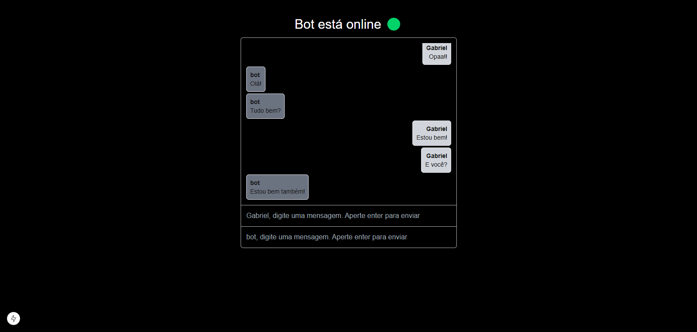
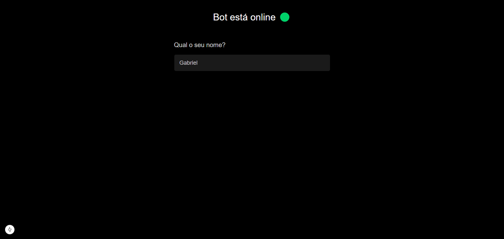

# Chat Real

## 💻 Projeto

O **Chat Real** é um projeto de chat interativo onde o usuário pode simular uma conversa em tempo real. O chat permite que o usuário envie mensagens que são exibidas dinamicamente. A ideia é, em breve, integrar uma inteligência artificial para respostas automáticas, proporcionando uma experiência ainda mais interativa.

## 🚀 Tecnologias

- React
- TypeScript
- Context API (para gerenciamento de estado)
- Hooks (useState, useEffect, useRef)
- TailwindCSS

## 📔 Conhecimentos abordados

- Uso do useState para gerenciamento de estado local
- Criação de contexto e gerenciamento global de estado com Context API
- Gerenciamento de mensagens em tempo real
- Manipulação de eventos de teclado (para envio de mensagens com a tecla "Enter")
- Utilização de useRef e useEffect para rolar a tela até a última mensagem
- Componentização em React com TypeScript

## 📲 Funcionalidade

- O projeto permite que o usuário insira seu nome e envie mensagens.
- As mensagens são exibidas dinamicamente na tela, com o nome do usuário e o conteúdo.
- O chat rola automaticamente para a última mensagem enviada.

## 🖼 Imagens do Projeto

Tela de inserção do nome:

## 🛠 Como rodar o projeto

1. Clone o repositório:

git clone https://github.com/seu-usuario/chat-real.git

2. Navegue até a pasta do projeto:

cd chat-real

3. Instale as dependências:

npm install

4. Execute o projeto localmente:

npm start

5. Acesse no navegador:

http://localhost:3000

## 📬 Contato

Em caso de dúvidas ou sugestões, entre em contato:

Email: devgabrielsilveira@gmail.com  
LinkedIn: [Gabriel Silveira](https://www.linkedin.com/in/gabriel-silveira-67979b18a/)  

**Desenvolvido por Gabriel Silveira** 🚀
